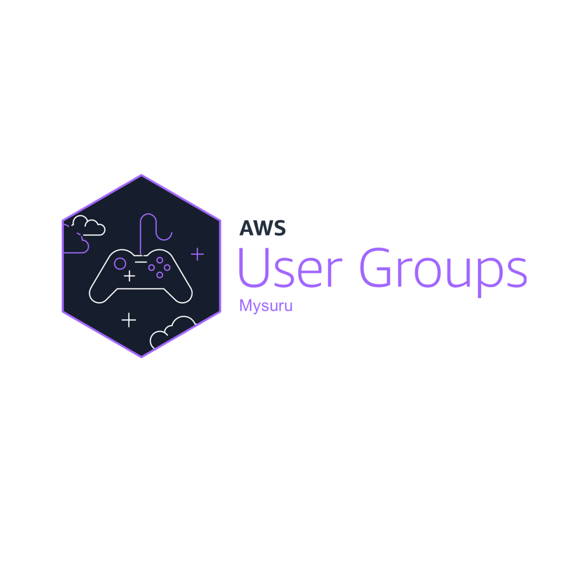

# AWS User Group Mysuru Website

Official Website of AWS User Group Mysuru community



## 🌟 About

This is the official website for AWS User Group Mysuru, a community of passionate AWS developers, solution architects, DevOps engineers, and cloud enthusiasts in Mysuru, Karnataka, India.

🌐 **Live Website**: [awsugmys.in](https://awsugmys.in)

## 🚀 Quick Start

### Prerequisites

- Node.js (v16 or higher)
- npm or yarn
- Git

### Local Development

1. **Clone the repository**
   ```bash
   git clone https://github.com/awsugmys/awsugmys-website.git
   cd awsugmys-website
   ```

2. **Install dependencies**
   ```bash
   npm install
   ```

3. **Start developing**
   ```bash
   npm run develop
   ```

4. **Open your browser**
   
   Your site is now running at `http://localhost:8000`!

## 🏗️ Architecture

This website is built with modern web technologies:

- **Gatsby** - Static site generator for React
- **React** - UI library
- **Bulma** - CSS framework for responsive design
- **GitHub Actions** - CI/CD pipeline
- **AWS S3** - Static website hosting
- **AWS CloudFront** - Global CDN
- **Terraform** - Infrastructure as Code

## 🎨 Branding

The website uses the official AWS User Group Mysuru branding:

- **Primary Logo**: Black background with purple text (`Black-Purple.png`)
- **Alternative Logo**: White background with purple text (`White-Purple.png`)
- **Usage Guidelines**: See [BRANDING.md](BRANDING.md) for detailed guidelines

## 📝 Content Management

### Adding Blog Posts

Create new blog posts in `src/pages/blog/` using this format:

```markdown
---
templateKey: blog-post
title: Your Post Title
date: 2024-12-16T10:00:00.000Z
description: Brief description of your post
featuredpost: false
featuredimage: /img/your-image.jpg
tags:
  - aws
  - community
  - mysuru
---

Your blog content here...
```

### Updating About Page

Edit `src/pages/about/index.md` to update:
- Leadership team information
- Contact details
- Community information

## 🚀 Deployment

### Infrastructure Setup

The AWS infrastructure is managed with Terraform:

1. **Prerequisites**
   - AWS CLI configured
   - Terraform installed

2. **Deploy Infrastructure**
   ```bash
   cd infrastructure
   ./deploy-infrastructure.sh
   ```

3. **Configure GitHub Actions**
   
   Add these secrets to your GitHub repository settings:
   - `AWS_ACCESS_KEY_ID`
   - `AWS_SECRET_ACCESS_KEY`
   - `AWS_REGION`
   - `S3_BUCKET_NAME`
   - `CLOUDFRONT_DISTRIBUTION_ID`

### Automatic Deployment

The website automatically deploys when you push to the `main` branch:

1. GitHub Actions builds the site
2. Deploys to S3
3. Invalidates CloudFront cache
4. Site is live at [awsugmys.in](https://awsugmys.in)

## 📁 Project Structure

```
awsugmys-website/
├── src/
│   ├── components/          # React components
│   ├── pages/              # Page content (markdown & React)
│   ├── templates/          # Page templates
│   └── img/               # Source images
├── static/
│   └── img/               # Static images
├── infrastructure/         # Terraform configuration
├── .github/
│   └── workflows/         # GitHub Actions
├── scripts/               # Utility scripts
└── docs/                  # Documentation
```

## 🛠️ Development

### Available Scripts

- `npm run develop` - Start development server
- `npm run build` - Build for production
- `npm run serve` - Serve production build locally
- `npm run clean` - Clean cache and public folders

### Adding New Features

1. Create feature branch: `git checkout -b feature/your-feature`
2. Make changes and test locally
3. Commit changes: `git commit -m "Add your feature"`
4. Push branch: `git push origin feature/your-feature`
5. Create Pull Request

## 🤝 Contributing

We welcome contributions from the community! Please:

1. Fork the repository
2. Create a feature branch
3. Make your changes
4. Test thoroughly
5. Submit a pull request

### Code Style

- Use Prettier for code formatting
- Follow React best practices
- Write meaningful commit messages
- Update documentation as needed

## 👥 Leadership Team

- **Yeshwanth L M** - Lead ([LinkedIn](https://www.linkedin.com/in/yeshwanth-l-m/))
- **Girish A R** - Co-Organiser ([LinkedIn](https://www.linkedin.com/in/girish-a-r-a16aa3159/))
- **Aniruddh Koundinya** - Co-Organiser ([LinkedIn](https://www.linkedin.com/in/aniruddhkoundinya/))

## 📞 Contact

- **Email**: [info@awsugmys.in](mailto:info@awsugmys.in)
- **Speaker Form**: [Submit a talk proposal](https://forms.gle/uMkLMM4uJtVZ4iY3A)

## 🔗 Community Links

- [Meetup Group](https://www.meetup.com/awsugmys/)
- [LinkedIn](https://www.linkedin.com/company/awsugmys)
- [Twitter](https://www.twitter.com/awsugmys)
- [Facebook](https://www.facebook.com/awsugmys/)

## 📄 License

This project is licensed under the MIT License - see the [LICENSE](LICENSE) file for details.

## 🙏 Acknowledgments

- AWS User Group Kochi for inspiration
- AWS Community for support
- All contributors and community members

---

**Built with ❤️ by AWS User Group Mysuru**